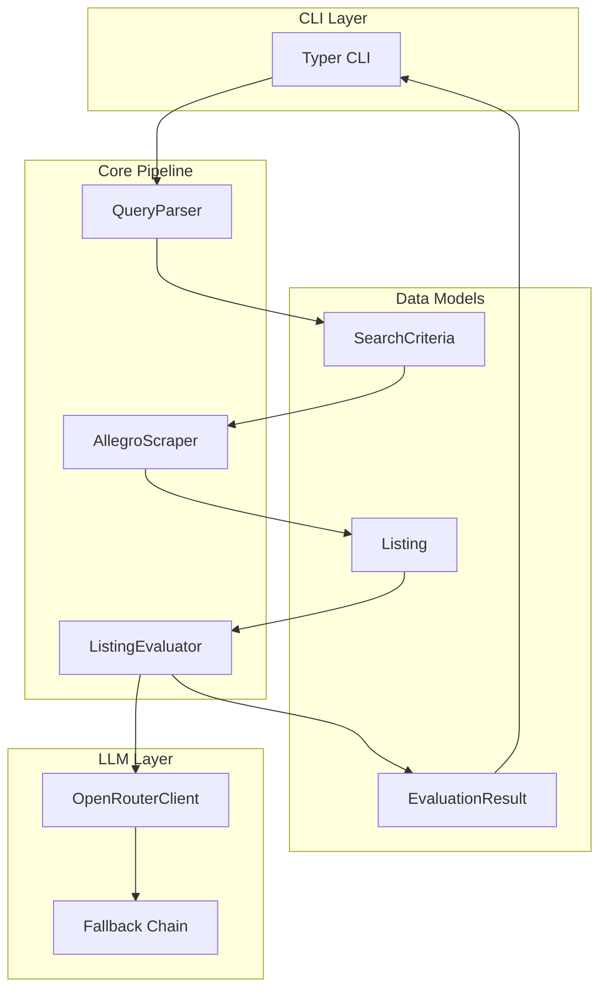
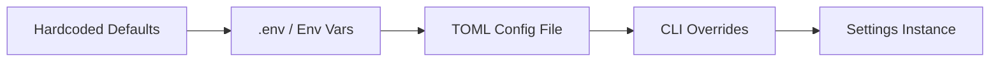
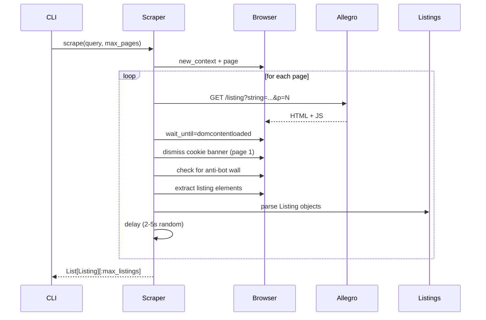
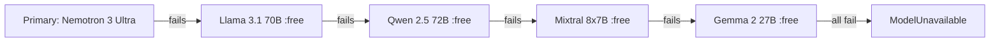

# Architecture

## High-Level Data Flow



---

## Module Responsibilities

### `allegro_evaluate/config.py`
**Configuration management (Settings)**
- `pydantic-settings` based, reads from `.env`, env vars, or TOML
- Centralized settings: API keys, model chain, pipeline params, scraping params
- Validation (e.g., `fallback_models` non-empty)
- `all_models()` returns ordered chain: primary → fallbacks

### `allegro_evaluate/models.py`
**Pydantic data models (no I/O)**
| Model | Purpose |
|-------|---------|
| `Listing` | Single scraped Allegro listing |
| `SearchCriteria` | Parsed query → structured filters |
| `QuickVerdict` | Stage-1 result (index, match, score, reason) |
| `DeepVerdict` | Stage-2 result (score, match, reasoning, pros, cons) |
| `EvaluationResult` | Unified result for either stage |
| `SearchReport` | Full pipeline output |
| `ChatMessage` | LLM message format |

### `allegro_evaluate/scraper.py`
**Playwright-based Allegro scraper**
- `AllegroScraper.scrape(query, max_pages) → List[Listing]`
- Pagination via `?p=N` on `https://allegro.pl/listing`
- Random delays, UA rotation, cookie consent handling
- Anti-bot detection (`spoczekalnia`, captcha, login redirect)
- Testable: inject `browser` to skip real launch

**Selectors (robust fallbacks):**
- Listing card: `article[data-listing-id]` → `div[data-listing-id]` → `article[class*='listing']`
- Title: `h2` or offer link
- Price: `[data-testid*='price']`, `[class*='price']`, `span[class*='cennik']`
- Snippet: `[class*='snippet']`, `[class*='description']`
- Image: `img[src]` or `img[data-src]`

### `allegro_evaluate/llm/client.py`
**OpenRouter client with fallback chain**
- `OpenRouterClient.chat_with_fallback(messages, models?) → LLMResponse`
- Tries each model in chain until one succeeds
- Retries on transient errors (429, 5xx, network) with exponential backoff
- `json_mode` adds `response_format: {"type": "json_object"}`
- Raises `ModelUnavailable` if entire chain fails

### `allegro_evaluate/llm/parser.py`
**QueryParser — natural language → SearchCriteria**
- Primary: LLM with `PARSER_SYSTEM_PROMPT` + JSON mode
- Fallback: Heuristic regex parser (price bounds, feature extraction)
- `_parse_heuristic()` handles:
  - `do 3000 zł`, `under 3000 PLN`, `max 4000` → `max_price`
  - `od 1000 zł`, `at least 1000` → `min_price`
  - Spec patterns (16GB RAM, SSD 512GB, etc.) → `must_have`

### `allegro_evaluate/llm/prompts.py`
**Prompt templates (all JSON-only output)**
- `PARSER_SYSTEM_PROMPT` — query → SearchCriteria JSON
- `STAGE1_SYSTEM_PROMPT` — batch filter → `{results: [QuickVerdict]}`
- `STAGE2_SYSTEM_PROMPT` — single listing deep eval → `DeepVerdict`
- Helper functions build user prompts from models

### `allegro_evaluate/llm/evaluator.py`
**Two-stage evaluation pipeline**
```python
def evaluate(listings, criteria) -> List[EvaluationResult]:
    candidates = _stage1(listings, criteria)  # indices
    results = _stage2(listings, candidates, criteria)  # parallel
    return sorted(results, key=score, reverse=True)[:top_k]
```
- **Stage 1**: Batches of `stage1_batch_size` (default 10), keeps top `stage1_candidates` (default 15)
- **Stage 2**: `ThreadPoolExecutor` with `stage2_concurrency` (default 4) workers
- Tracks `models_used` for reporting

### `allegro_evaluate/cli.py`
**Typer CLI**
- `search` command — full pipeline
- `config show/setup/set-model` — settings management
- Rich table, JSON, Markdown renderers
- Masks API key in `config show`

### `allegro_evaluate/utils.py`
**Shared helpers**
- `extract_json()` — robust JSON extraction from LLM output (handles fences, finds balanced braces)
- `parse_price_from_text()` — PLN price parsing with Polish formats
- `clean_whitespace()` — normalize whitespace

### `allegro_evaluate/logging.py`
**Structured logging (structlog)**
- `configure_logging(level, json)` — console or JSON renderer
- `get_logger(name)` — module loggers

---

## Configuration Flow



Priority: CLI > TOML > Env > Defaults

---

## Scraping Sequence



---

## Evaluation Pipeline

```mermaid
flowchart TD
    Listings[List[Listing]] --> Stage1[Stage 1: Batch Filter]
    Stage1 --> Batch1[Batch 0-9]
    Stage1 --> Batch2[Batch 10-19]
    Stage1 --> BatchN[...]
    Batch1 --> Verdicts1[QuickVerdict[]]
    Batch2 --> Verdicts2[QuickVerdict[]]
    Verdicts1 --> Filter[Keep match=true]
    Verdicts2 --> Filter
    Filter --> Sort[Sort by score desc]
    Sort --> TopCandidates[Top stage1_candidates indices]
    TopCandidates --> Stage2[Stage 2: Deep Evaluation]
    Stage2 --> Parallel[ThreadPoolExecutor]
    Parallel --> Eval1[Listing 0]
    Parallel --> Eval2[Listing 1]
    Parallel --> EvalN[...]
    Eval1 --> DeepVerdict[DeepVerdict]
    Eval2 --> DeepVerdict
    DeepVerdict --> Results[EvaluationResult[]]
    Results --> Sort2[Sort by score desc]
    Sort2 --> TopK[Top TOP_K]
```

---

## Model Fallback Chain



- Each model retried `max_retries` times (default 3) with backoff
- `stage1_model` defaults to first fallback (cheap)
- Stage 2 uses full chain starting from primary

---

## Testing Strategy

| Layer | Approach |
|-------|----------|
| **Models** | Direct instantiation, validation tests |
| **Config** | Settings with test values, env override tests |
| **Utils** | Pure function unit tests |
| **Scraper** | Fake `Browser`/`Page`/`Element` objects (tests/fakes.py) |
| **LLM Client** | `httpx.MockTransport` with canned responses |
| **Parser** | `StubClient` returning canned LLM responses + heuristic tests |
| **Evaluator** | `llm_handler_from_resolver` branching on prompt content |

All tests run without network or browser: `pytest` completes in ~0.2s.

---

## Extending the Pipeline

### Add a new LLM model
1. Add to `fallback_models` in `.env` or `Settings`
2. No code changes needed

### Change evaluation criteria
1. Modify `SearchCriteria` in `models.py`
2. Update `PARSER_SYSTEM_PROMPT` in `prompts.py`
3. Update `STAGE2_SYSTEM_PROMPT` to reference new fields

### Add a new output format
1. Add to `OutputFormat` literal in `config.py`
2. Add `_render_<format>()` in `cli.py`
3. Wire in `render_report()`

### Support another marketplace
1. New scraper module (same interface: `scrape(query) → List[Listing]`)
2. Adjust selectors in new scraper
3. No changes to LLM/evaluator layers