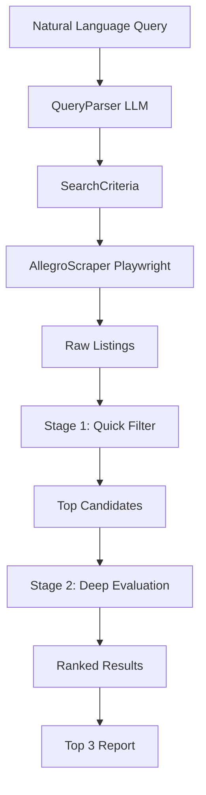

# Allegro Evaluate — Overview

> **Search Allegro with natural language and evaluate listings with LLMs (OpenRouter).**

---

## What it does

1. **Parse** — You describe what you want in plain language (English or Polish):
   > `"laptop 16GB RAM SSD 512GB under 3000 PLN"`
   > `"szukam iPhone 15 128GB do 4000 zł"`

2. **Search** — The tool scrapes Allegro (via Playwright) and collects up to 100 listings with titles, prices, snippets, URLs, and images.

3. **Evaluate (two stages)**:
   - **Stage 1 (quick, cheap model)** — Filters out obvious non-matches, keeps top ~15 candidates.
   - **Stage 2 (primary model: Nemotron 3 Ultra)** — Deep evaluation of each candidate against your criteria. Produces match score (0–100), reasoning, pros/cons.

4. **Report** — Returns **top 3** best matches with detailed explanations.

---

## Architecture



---

## Key Features

| Feature | Details |
|---------|---------|
| **Natural language input** | English or Polish queries |
| **Two-stage LLM pipeline** | Cheap filter → expensive deep eval |
| **Model fallback chain** | Primary (Nemotron 3 Ultra) → free fallbacks (Llama 3.1 70B, Qwen 2.5 72B, Mixtral 8x7B, Gemma 2 27B) |
| **Respectful scraping** | Random delays, UA rotation, cookie consent handling |
| **Polish listings** | Allegro content in Polish; code/docs in English |
| **Rich CLI** | Table, JSON, Markdown output |
| **Type-safe** | Pydantic models throughout |
| **Tested** | 42 unit tests with mocked dependencies |

---

## Quick Start

```bash
# 1. Clone & install
git clone https://github.com/dawid2077/allegro-evaluate.git
cd allegro-evaluate
pip install -e ".[dev]"
playwright install chromium

# 2. Configure OpenRouter key
allegro-evaluate config setup

# 3. Search
allegro-evaluate search "laptop 16GB RAM SSD 512GB pod 3000 zł"
```

See [Setup](setup.md) for details.

---

## Project Structure

```
allegro-evaluate/
├── allegro_evaluate/
│   ├── cli.py              # Typer CLI entry point
│   ├── config.py           # Settings (pydantic-settings)
│   ├── logging.py          # Structured logging (structlog)
│   ├── models.py           # Pydantic data models
│   ├── scraper.py          # Playwright Allegro scraper
│   ├── utils.py            # Shared helpers (JSON, price parsing)
│   └── llm/
│       ├── client.py       # OpenRouter client + fallback chain
│       ├── parser.py       # Query → SearchCriteria
│       ├── prompts.py      # All prompt templates
│       └── evaluator.py    # Two-stage evaluation pipeline
├── tests/                  # 42 unit tests (mocked)
├── docs/                   # Obsidian-compatible documentation
├── pyproject.toml
└── .env.example
```

---

## Requirements

- Python 3.11+
- Playwright Chromium (`playwright install chromium`)
- OpenRouter API key (free tier works with fallback models)

---

## License

MIT